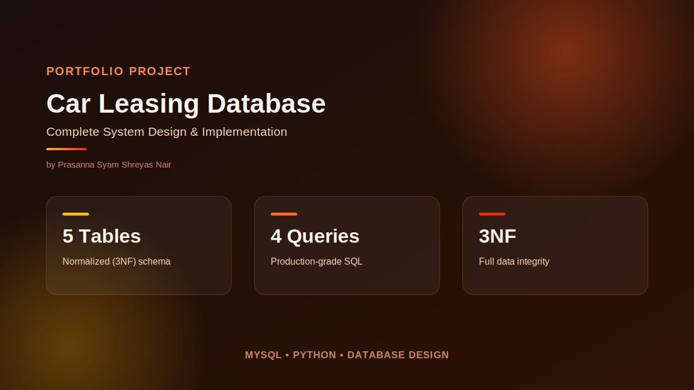
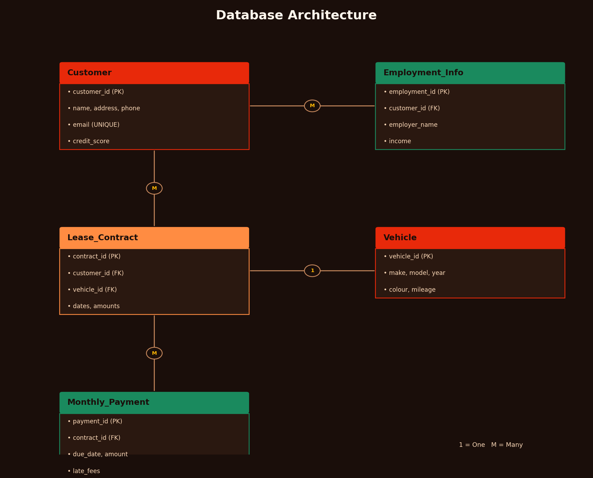
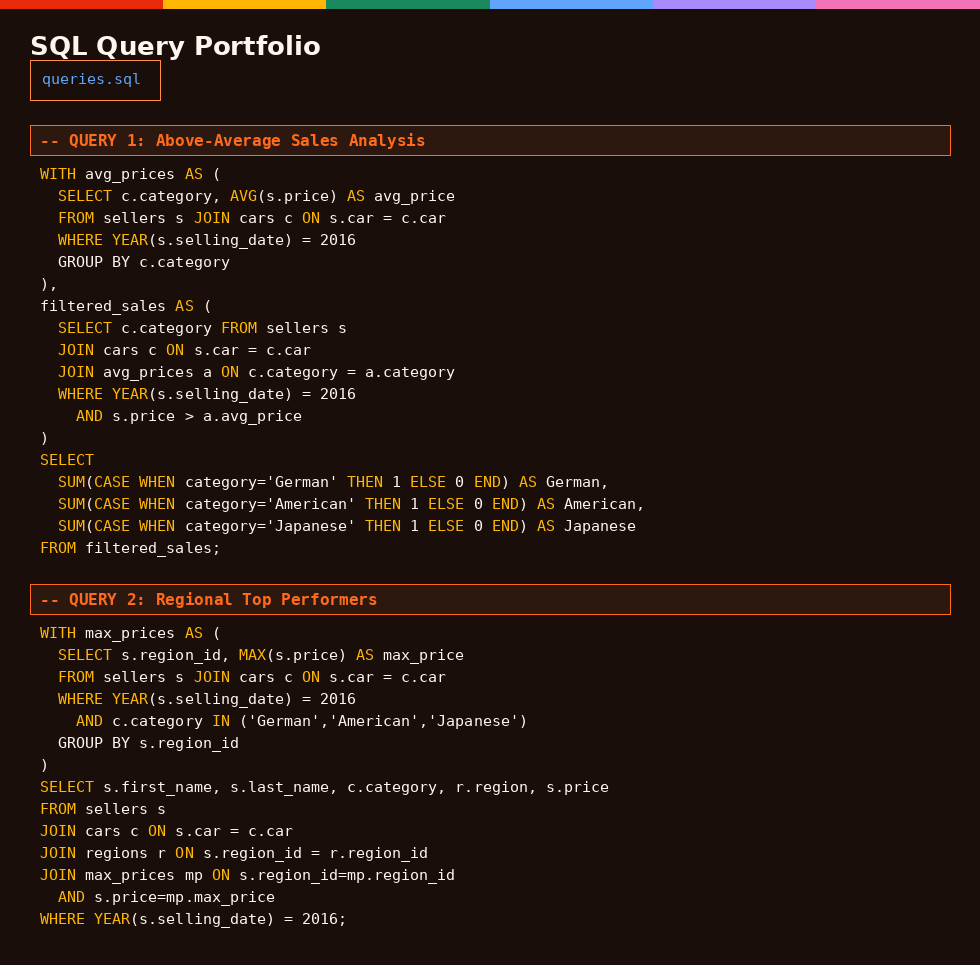

#  Car Leasing Database System

A complete database solution for car leasing operations, featuring normalized schema design, entity-relationship modeling, and production-ready SQL queries for business intelligence.



##  Table of Contents

- [Overview](#overview)
- [Features](#features)
- [Database Schema](#database-schema)
- [SQL Queries](#sql-queries)
- [Technologies Used](#technologies-used)
- [Installation](#installation)
- [Usage](#usage)
- [Project Structure](#project-structure)
- [Business Value](#business-value)
- [Future Enhancements](#future-enhancements)
- [Author](#author)

##  Overview

This project demonstrates end-to-end database design and implementation for a car leasing business. The system manages customers, employment information, vehicles, lease contracts, and monthly payments while maintaining data integrity through normalized design (3NF).

**Key Objectives:**
- Design a scalable relational database schema
- Implement business logic through SQL queries
- Enable real-time reporting and analytics
- Maintain data integrity and consistency

##  Features

### Database Design
-  **5-table normalized schema (3NF)** - Eliminates data redundancy
-  **Entity-Relationship Diagram (ERD)** - Clear visual representation
-  **Primary/Foreign key constraints** - Ensures referential integrity
-  **Intelligent relationships** - Customer→Leases→Payments flow

### SQL Capabilities
-  **4 production-ready queries** - Business intelligence insights
-  **Common Table Expressions (CTEs)** - Complex data transformations
-  **Multi-table JOINs** - Data aggregation across entities
-  **Correlated subqueries** - Advanced filtering logic

### Business Intelligence
-  **Sales analysis** - Above-average performance tracking
-  **Regional insights** - Top performer identification
-  **Market segmentation** - Premium vs regular categorization
-  **Revenue forecasting** - KPI monitoring capabilities

##  Database Schema



### Tables

#### 1. Customer
Stores customer information for individuals and businesses.

| Column | Type | Description |
|--------|------|-------------|
| customer_id (PK) | INT | Unique customer identifier |
| name | VARCHAR | Customer full name |
| address | VARCHAR | Physical/billing address |
| phone | VARCHAR | Contact number |
| email | VARCHAR (UNIQUE) | Email address |
| credit_score | INT | Credit score (300-850) |
| customer_type | ENUM | Individual/Business |
| employment_status | VARCHAR | Employment status |

#### 2. Employment_Info
Tracks customer employment history and income.

| Column | Type | Description |
|--------|------|-------------|
| employment_id (PK) | INT | Unique employment record |
| customer_id (FK) | INT | Links to Customer |
| employer_name | VARCHAR | Name of employer |
| employer_phone | VARCHAR | Employer contact |
| job_title | VARCHAR | Customer's role |
| employment_duration | INT | Duration in months |
| income | DECIMAL | Monthly/annual income |

#### 3. Vehicle
Catalogs all available vehicles.

| Column | Type | Description |
|--------|------|-------------|
| vehicle_id (PK) | INT | Unique vehicle identifier |
| make | VARCHAR | Manufacturer |
| model | VARCHAR | Vehicle model |
| year | INT | Manufacturing year |
| colour | VARCHAR | Vehicle color |
| initial_mileage | INT | Starting mileage |
| current_mileage | INT | Current mileage |

#### 4. Lease_Contract
Manages lease agreements between customers and vehicles.

| Column | Type | Description |
|--------|------|-------------|
| contract_id (PK) | INT | Unique contract identifier |
| customer_id (FK) | INT | Links to Customer |
| vehicle_id (FK) | INT | Links to Vehicle |
| lease_type | ENUM | Personal/Commercial |
| lease_start_date | DATE | Contract start |
| lease_end_date | DATE | Contract end |
| monthly_payment_amount | DECIMAL | Monthly payment |
| mileage_allowance | INT | Allowed kilometers |
| security_deposit | DECIMAL | Deposit amount |
| lease_status | ENUM | Active/Expired/Terminated |

#### 5. Monthly_Payment
Tracks payment schedules and history.

| Column | Type | Description |
|--------|------|-------------|
| payment_id (PK) | INT | Unique payment identifier |
| contract_id (FK) | INT | Links to Lease_Contract |
| due_date | DATE | Payment due date |
| amount_due | DECIMAL | Expected amount |
| is_overdue | BOOLEAN | Overdue flag |
| late_fees | DECIMAL | Late payment charges |
| payment_date | DATE | Actual payment date |
| payment_amount | DECIMAL | Amount paid |

### Entity Relationships

```
Customer (1) ──────< Employment_Info (M)
    │
    └──────< Lease_Contract (M) ──────< Monthly_Payment (M)
                    │
                    └────── Vehicle (1)
```

##  SQL Queries



### Query 1: Above-Average Sales Analysis
**Purpose:** Count German, American, and Japanese cars sold above their category average in 2016.

**Techniques Used:**
- Common Table Expressions (CTEs)
- Multi-level aggregation
- Conditional counting (CASE statements)

**Business Value:** Identifies high-performing vehicle categories.

### Query 2: Regional Top Performers
**Purpose:** Find the highest-priced seller in each of the 7 regions.

**Techniques Used:**
- Subqueries with MAX()
- 4-table JOINs
- Multi-criteria filtering

**Business Value:** Recognizes top sales performers by region.

### Query 3: Premium Market Segmentation
**Purpose:** Identify sellers who exceeded regional averages for German/French cars (2015-2016).

**Techniques Used:**
- Correlated subqueries
- Geographic & time filtering
- Business logic (CASE for premium threshold)

**Business Value:** Segments premium market opportunities.

### Query 4: Premium vs Regular Count
**Purpose:** Aggregate counts of premium (≥120K) vs regular sedan sales.

**Techniques Used:**
- Nested subqueries
- Query results as data source
- Summary aggregation

**Business Value:** Market composition analysis.

##  Technologies Used

- **Database:** MySQL 8.0+
- **SQL:** Advanced queries (CTEs, JOINs, Subqueries)
- **Design:** 3NF Normalization
- **Tools:** MySQL Workbench, ERD Designer
- **Documentation:** Markdown, Diagrams

##  Installation

### Prerequisites
- MySQL 8.0 or higher
- MySQL Workbench (optional, for visualization)

### Steps

1. **Clone the repository**
```bash
git clone https://github.com/YOUR_USERNAME/car-leasing-database.git
cd car-leasing-database
```

2. **Create the database**
```bash
mysql -u root -p < sql/schema.sql
```

3. **Load sample data (optional)**
```bash
mysql -u root -p car_leasing < sql/sample_data.sql
```

4. **Run queries**
```bash
mysql -u root -p car_leasing < sql/queries.sql
```

##  Usage

### Running Individual Queries

```sql
-- Connect to database
USE car_leasing;

-- Execute Query 1
SOURCE sql/query_1_above_average_sales.sql;

-- Execute Query 2
SOURCE sql/query_2_regional_top_performers.sql;

-- Execute Query 3
SOURCE sql/query_3_premium_market_segmentation.sql;

-- Execute Query 4
SOURCE sql/query_4_premium_vs_regular_count.sql;
```

### Expected Output

Each query returns business insights:
- **Query 1:** Count by category (German, American, Japanese)
- **Query 2:** Top seller per region with details
- **Query 3:** Sellers exceeding regional averages
- **Query 4:** Premium vs regular count summary

##  Project Structure

```
car-leasing-database/
│
├── README.md                          # This file
├── LICENSE                            # MIT License
│
├── docs/
│   ├── images/
│   │   ├── project_overview.png      # Project stats
│   │   ├── database_architecture.png # ERD
│   │   └── sql_queries.png           # Query showcase
│   │
│   ├── ERD.pdf                        # Full ERD document
│   └── DESIGN_DECISIONS.md           # Architecture decisions
│
├── sql/
│   ├── schema.sql                     # Database schema
│   ├── sample_data.sql               # Sample data (optional)
│   ├── queries.sql                    # All 4 queries
│   │
│   └── individual_queries/
│       ├── query_1_above_average_sales.sql
│       ├── query_2_regional_top_performers.sql
│       ├── query_3_premium_market_segmentation.sql
│       └── query_4_premium_vs_regular_count.sql
│
└── tests/
    └── query_tests.sql                # Query validation tests
```

##  Business Value

### Operational Benefits
- **Real-time payment tracking** - Instant overdue alerts
- **Customer scoring** - Credit risk assessment
- **Revenue forecasting** - Predictive analytics
- **KPI monitoring** - Performance dashboards

### Scalability
- Normalized design supports growth
- Indexed queries for performance
- Modular structure for extensions
- Clear documentation for maintenance

### Reporting Capabilities
- Sales performance by category
- Regional performance comparison
- Premium market analysis
- Payment history tracking

##  Future Enhancements

- [ ] Add stored procedures for common operations
- [ ] Implement triggers for automated updates
- [ ] Create views for frequent queries
- [ ] Add data validation rules
- [ ] Develop REST API interface
- [ ] Build analytics dashboard
- [ ] Integrate with payment gateway
- [ ] Add audit logging
- [ ] Implement data archival strategy
- [ ] Create migration to NoSQL for IoT data

##  Author

**Prasanna Syam Shreyas Nair**
-  Email: shreyasnar1998@gmail.com
-  Contact No.: +353 892064414
- LinkedIn: [linkedin.com/in/psshreyasnair](http://linkedin.com/in/psshreyasnair)
-  Location: Dublin, Ireland
-  Education: MSc Business Analytics

##  License

This project is licensed under the MIT License - see the [LICENSE](LICENSE) file for details.

##  Acknowledgments

- Database design principles from industry best practices
- SQL optimization techniques from MySQL documentation
- Normalization theory from database management fundamentals

---

 **If you find this project useful, please consider giving it a star!**

 **Open to opportunities in Data Analytics, Business Intelligence, and Data Engineering roles.**
